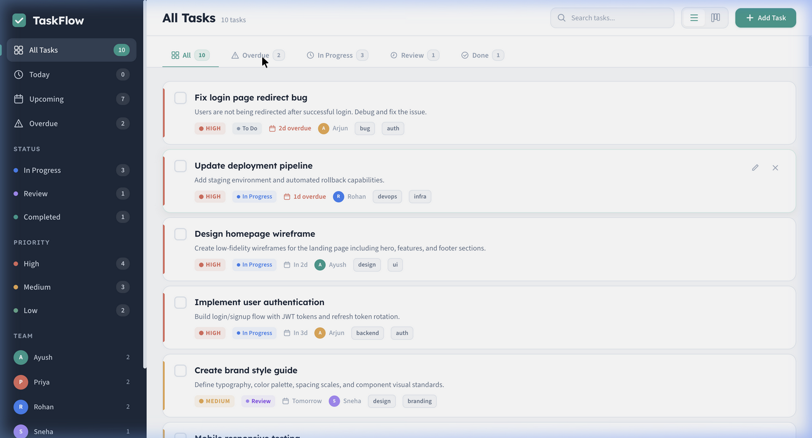
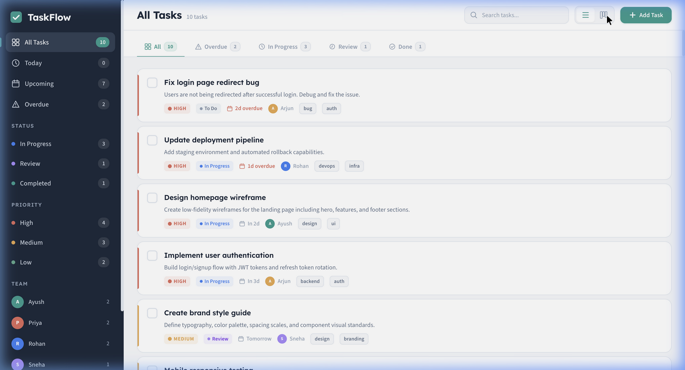
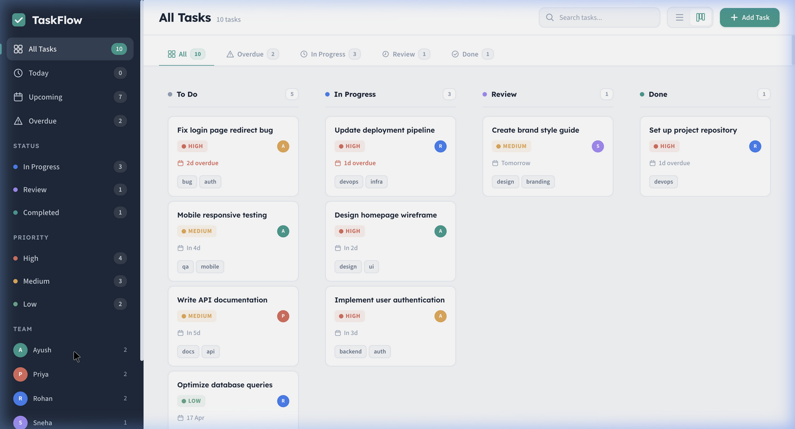
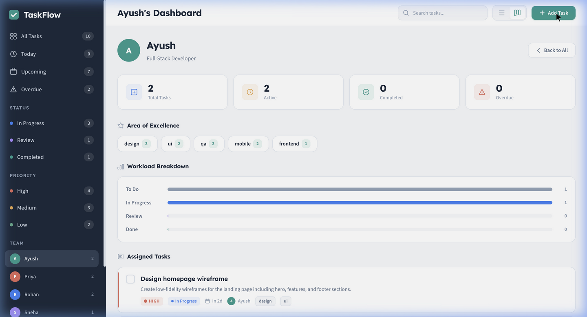

# TaskFlow — Smart Task Manager

A clean, professional, and highly functional task management web application built entirely with vanilla web technologies. It focuses on productivity, offering a seamless user experience with features like smart suggestions, team member dashboards, and dynamic categorization.

**Live Demo:** [https://taskflow-pied-sigma.vercel.app/](https://taskflow-pied-sigma.vercel.app/)

## ✨ Key Features

*   **Smart Suggestions (AI-like):** Auto-detects task types from title keywords (e.g., typing "deploy" suggests DevOps assignee + tags). Recommends priority, assignee, and tags based on context.
*   **Dual Views:** Seamlessly toggle between a detailed **List View** and a Kanban-style **Board View**.
*   **Team Member Dashboards:** Click any team member to view their dedicated dashboard, complete with stats, area of excellence, workload breakdown, and assigned tasks.
*   **Category Tabs & Filtering:** Quick sub-filters on the home page (All, Overdue, In Progress, Review, Done) and robust sidebar filtering (by Priority, Team, Date).
*   **Core Productivity:** Full CRUD functionality, priority levels, status workflow, deadline tracking with smart formatting, and custom tags.
*   **Polished UX:** Real-time search, keyboard shortcuts (`N` for new task, `Cmd+K` for search), toast notifications, and a responsive, non-neon, clean aesthetic.

## 📸 Screenshots

### List View


### Kanban Board View


### Team Member Dashboard


### Add Task Modal & Smart Suggestions


## 🛠 Tech Stack

*   **Structure:** Semantic HTML5
*   **Styling:** Vanilla CSS3 (Custom Properties, Grid, Flexbox, Animations)
*   **Logic:** Vanilla JavaScript (ES6+)
*   **Fonts:** Google Fonts (Lexend + Source Sans 3)
*   **Storage:** `localStorage` API
*   **Deployment:** Vercel

> Zero frameworks. Zero dependencies. Pure HTML/CSS/JS.

## 🚀 Running Locally

1.  Clone the repository:
    ```bash
    git clone https://github.com/Ayushgupta0511/Taskflow.git
    ```
2.  Navigate to the project directory:
    ```bash
    cd Taskflow
    ```
3.  Serve the files using any static local web server (e.g., Python's `http.server` or Node's `http-server`).
    ```bash
    # Using Python 3
    python3 -m http.server 8080
    ```
4.  Open your browser and navigate to `http://localhost:8080`.

## 🤝 Contributing

Contributions are welcome! Please feel free to submit a Pull Request.
